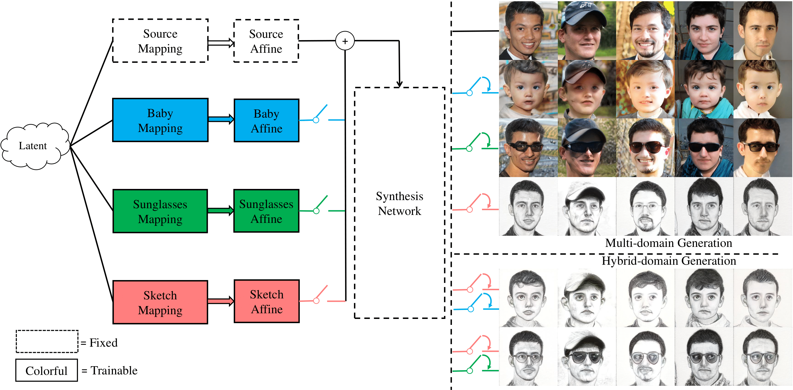

# DoRM: Domain Re-Modulation for Few-Shot Generative Domain Adaption (NeurIPS 2023)
[](https://arxiv.org/abs/2302.02550)

> **Domain Re-Modulation for Few-Shot Generative Domain Adaption**<br>
> Yi Wu, Ziqiang Li, Chaoyue Wang, Heliang Zheng, Shanshan Zhao, Bin Li, Dacheng Tao <br>
> 
>**Abstract**: <br>
> In this study, we delve into the task of few-shot Generative Domain Adaptation (GDA), which involves transferring a pre-trained generator from one domain to a new domain using only a few reference images. Inspired by the way human brains acquire knowledge in new domains, we present an innovative generator structure called Domain Re-Modulation (DoRM). DoRM not only meets the criteria of high quality, large synthesis diversity, and cross-domain consistency, which were achieved by previous research in GDA, but also incorporates memory and domain association, akin to how human brains operate. Specifically, DoRM freezes the source generator and introduces new mapping and affine modules (M&A modules) to capture the attributes of the target domain during GDA. This process resembles the formation of new synapses in human brains. Consequently, a linearly combinable domain shift occurs in the style space. By incorporating multiple new M&A modules, the generator gains the capability to perform high-fidelity multi-domain and hybrid-domain generation. Moreover, to maintain cross-domain consistency more effectively, we introduce a similarity-based structure loss. This loss aligns the auto-correlation map of the target image with its corresponding auto-correlation map of the source image during training. Through extensive experiments, we demonstrate the superior performance of our DoRM and similarity-based structure loss in few-shot GDA, both quantitatively and qualitatively.




## Getting Started

The code relies on the official pytorch implementation of [StyleGAN2-ADA](https://github.com/NVlabs/stylegan2-ada-pytorch) and official pytorch implementation of [DiFa](https://github.com/YBYBZhang/DiFa).

### Installation

- Clone this repo:

  ```shell
  git clone https://github.com/wuyi2020/DoRM.git
  cd DoRM
  ```

- Dependencies:

  Our code relies on the environment in the official [StyleGAN2-ADA](https://github.com/NVlabs/stylegan2-ada-pytorch).

  Download the [CLIP](https://github.com/openai/CLIP) and unzip to the main folder of DoRM. Then run the following command:

  ```shell
  python CLIP/setup.py install
  ```
  
- Download pretrain pretrained ViT-B/32 and ViT-B/16 models (Optional).
  
- Download pretrained [StyleGAN-ADA](https://github.com/NVlabs/stylegan2-ada-pytorch) and GAN inversion models([pSp](https://github.com/eladrich/pixel2style2pixel)).

### Datasets

You can obtain training images from [Few-shot Image Generation via Cross-domain Correspondence](https://github.com/WisconsinAIVision/few-shot-gan-adaptation) for 10-shot generative domain adaption, [The Face of Art](https://github.com/papulke/face-of-art) for one-shot generative domain adaption.

Then process the training datasets using the `dataset_tool.py` to a dir.

### Training

To convert a generator from the source domain to the target domain,  run the training script:

```shell
python train.py \
 --outdir=path/to/output \
 --data=/path/to/training_data \
 --gpus=2 --mirror=TRUE --cfg=paper256 --batch=8 \
 --metricdata=/path/to/metricdata or /path/to/training_data \
 --resume=/path/to/pretrain_GAN \
 --psp_path=/path/to/psp_encoder --clipdata=/path/to/training_data/00000 \
 --vit16=/path/to/ViT-B/16 --vit32=/path/to/ViT-B/32
```

Notably, you can set the re-modulation weight alpha in the `constant.py`.

### Inference

Our transferred models can be found in [here](https://drive.google.com/drive/folders/1cFn2Q4Yi-HwGU1_11HsdPPruHA6mvbjC?usp=sharing).

To generate images from trained GAN models, run the inference script:

```shell
python generate.py --outdir=/path/to/output --trunc=1 --seeds=265,297,849 \
 --network=/path/to/trained_model
```
